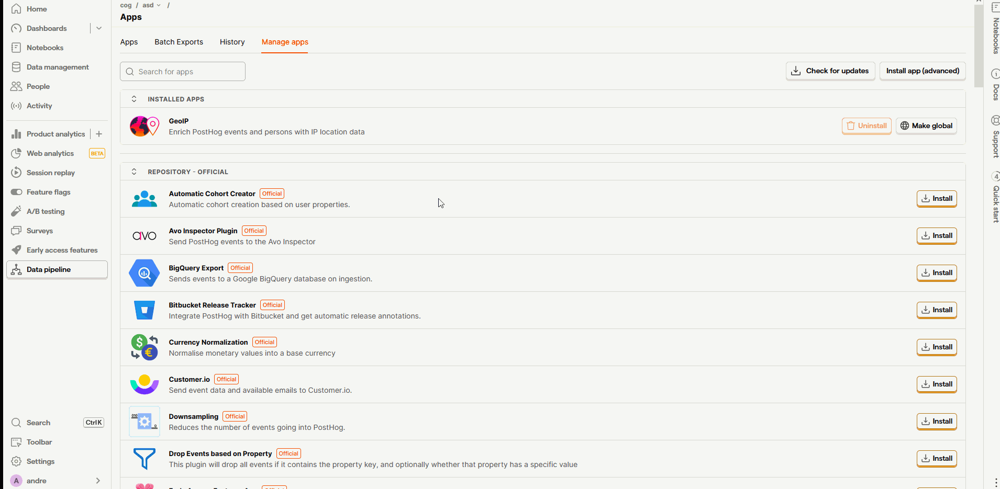

## Flow Task Plugin

This plugin allows you to track conversation flows between a user and a agent  (agent apologies, user complaints) into [PostHog-LLM](https://github.com/postlang/posthog-llm) or [PostHog-LLM-Lite](https://github.com/postlang/posthog-llm-lite). To use this plugin in PostHog-LLM, simply install the [plugin's](https://github.com/minuva/llm-flow-classification) backend, it runs the machine learning model for flow classification. The plugin links the PostHog data ingestion process with the hosted machine learning model.

## How to install in PostHog-LLM

1. Open PostHog-LLM.
2. Open the Data pipeline page from the sidebar.
3. Head to the Manage apps tab.
4. Install app advanced button
5. "Install from GitHub, GitLab or npm" using this repository's URL.
6. Click on the Apps tab, and it will prompt you for the API_SERVER_URL (e.g., http://localhost:9612, or http://flowdetect:9612 if running in a Docker container in the postlang network).

